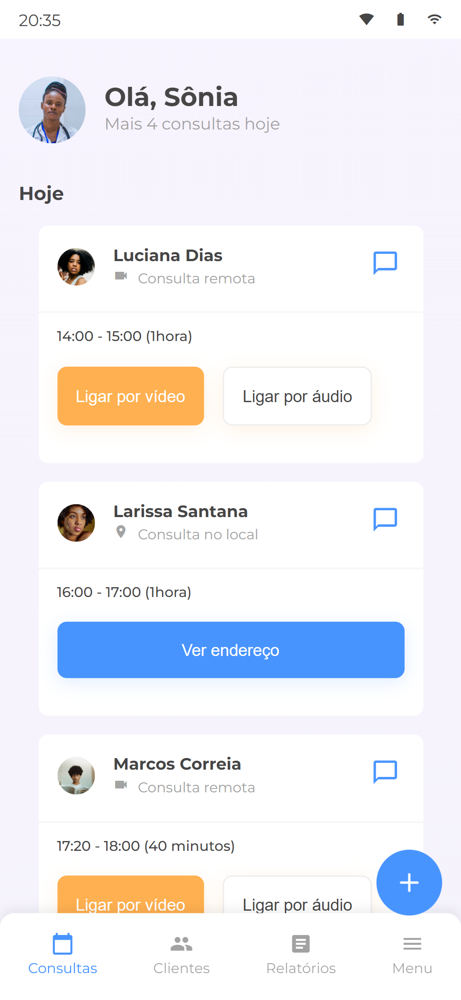

# 
 Alura Med 

  

---

Desafio projeto do [7 days of code ](https://7daysofcode.io/matricula/responsividade) de _responsividade_, que me permitirá praticar os conhecimentos adquiridos durante o meu curso de formação em Front-end pela [Alura](https://www.alura.com.br/escola-front-end). Este projeto tem como tema a criação de um design responsivo usando as seguintes habilidades:

* HTML para criar a estrutura da página;
  
* CSS para estilizar os elementos e garantir que eles se adaptem a diferentes dispositivos;

* A abordagem Mobile-first, que enfatiza o design para dispositivos móveis em primeiro lugar;

* Unidades relativas, como em porcentagens ou "rem", para garantir que o layout seja flexível e dimensionado corretamente em diferentes tamanhos de tela;
  
* Media queries, para aplicar estilos específicos quando a tela atende a certas condições.

